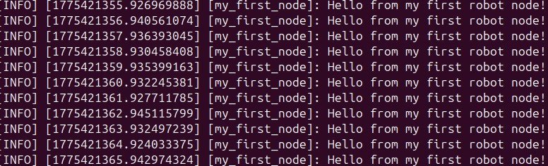
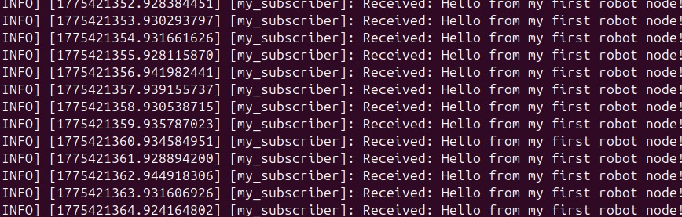

# Day 3 - ROS 2 Publisher & Subscriber

## Overview
Implemented a publisher and subscriber in ROS 2 (Jazzy). The publisher sends messages, and the subscriber receives them.

## Screenshots

### Publisher

### Subscriber

## Result
- Publisher and Subscriber nodes communicated successfully.
