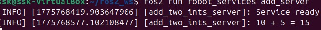
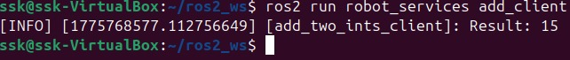
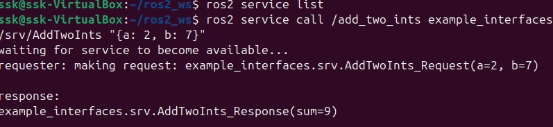

# Day 4 - ROS 2 Services & Launch Files

## What I built
- Implemented a ROS 2 service (AddTwoInts)
- Created client-server communication
- Tested using ROS 2 CLI
- Used launch file to run multiple nodes

---

## Key Concepts Learned
- Difference between Topics vs Services
- Request-Response communication
- ROS 2 launch system

---

## 🟢 Service Server

---

## 🔵 Client Result

---

## 🟡 CLI Test

---

## Output
- Client result: 15
- CLI result: sum = 9
