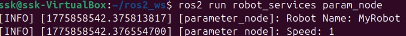
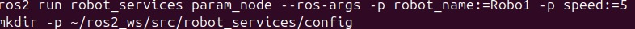

# Day 5 - ROS 2 Parameters

## What I built
- Created a parameterized ROS 2 node
- Configured parameters using CLI and YAML file
- Removed hardcoded values

---

## Key Learnings
- Parameters allow flexible configuration
- CLI can override values at runtime
- YAML files are used for structured configs

---

## 🟢 Default Parameters

---

## 🔵 CLI Override

---

## 🟡 YAML Configuration

