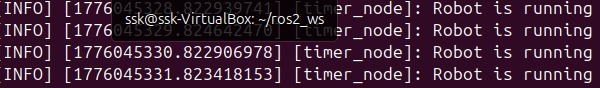
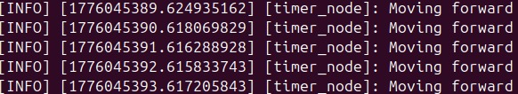

# Day 6 - ROS 2 Timers

## What I built
- A ROS 2 node that runs continuously using a timer
- Prints messages at fixed intervals
- Uses parameters to control behavior

---

## Key Learnings
- Timers enable continuous execution
- Nodes can run loops like real robots
- Parameters control runtime behavior

---

## Default Output

---

## CLI Output

