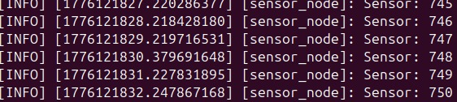
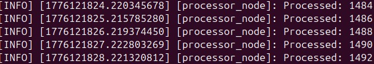
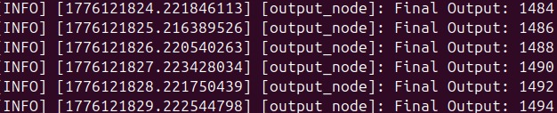

# Day 7 - Multi Node System

## What I built
- A 3-node ROS 2 system
- Sensor → Processing → Output pipeline

---

## Key Learnings
- Multi-node communication
- Topic-based data flow
- Modular system design

---

## Sensor Node

---

## Processor Node

---

## Output Node

