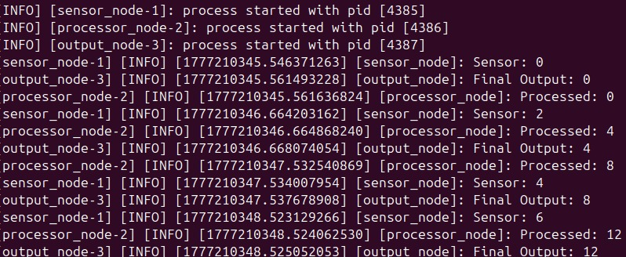

# Day 9 - Parameters with Launch

## What I built
- Dynamic system controlled using parameters
- Changed node behavior without modifying code

---

## Key Learnings
- Parameters make systems flexible
- Launch files control behavior
- Used in real robotics systems

---

## Output

