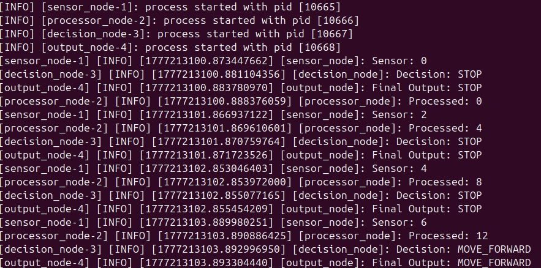

# Day 10 - Decision-Based Robot System (ROS 2)

## 🚀 Overview
In this project, I built a multi-node ROS 2 system that simulates a basic robot decision-making pipeline. The system processes sensor data and makes decisions such as stopping or moving forward based on defined logic.

---

## 🧠 System Architecture
Sensor Node → Processor Node → Decision Node → Output Node

---

## ⚙️ How It Works

1. **Sensor Node**
   - Generates incremental data (simulated sensor input)

2. **Processor Node**
   - Processes incoming data (multiplies values)

3. **Decision Node**
   - Applies decision logic:
     - If value > 10 → MOVE_FORWARD
     - Else → STOP

4. **Output Node**
   - Displays final robot action

---

## 📊 Example Output

