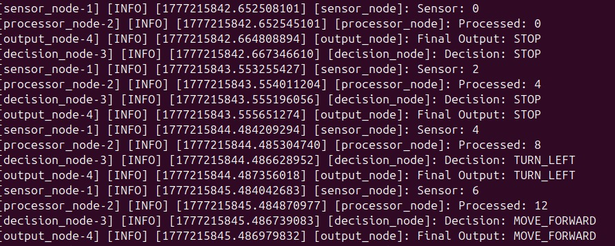

# Obstacle Detection & Decision System (ROS 2)

## Overview
This project demonstrates a simple robotic decision-making pipeline using ROS 2.

The system simulates how a robot processes sensor data and makes movement decisions in real time.

---

## System Architecture

Sensor Node → Processor Node → Decision Node → Output Node

---

## How It Works

1. **Sensor Node**
   - Generates incremental data (simulated sensor values)

2. **Processor Node**
   - Processes incoming data (multiplies values)

3. **Decision Node**
   - Applies decision logic:
     - If value < 6 → STOP  
     - If value < 10 → TURN_LEFT  
     - Else → MOVE_FORWARD  

4. **Output Node**
   - Displays the final robot action

---

## Example Output

---

## Tech Stack
- ROS 2 (Jazzy)
- Python
- rclpy

---

## Key Learning
- Multi-node communication in ROS2  
- Topic-based data flow  
- Real-time decision making
